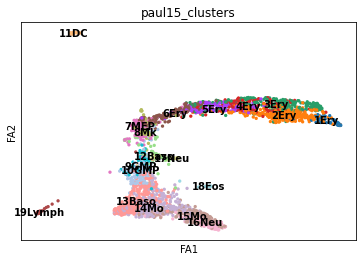
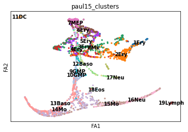
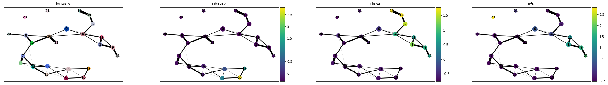
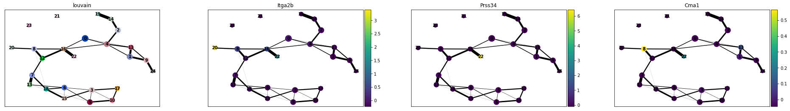
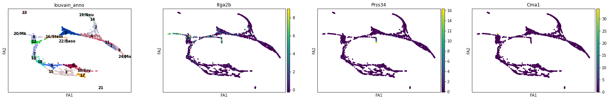
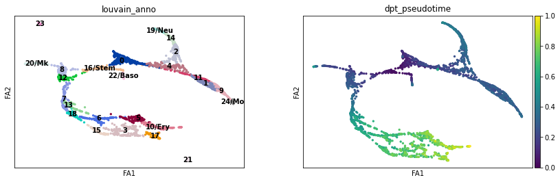
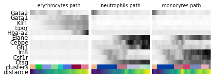

# Paul et al., 2015 PAGA Analysis

For details, please refer to https://scanpy-tutorials.readthedocs.io/en/latest/paga-paul15.html


```python
import numpy as np
import pandas as pd
import matplotlib.pyplot as pl
from matplotlib import rcParams
import scanpy as sc
```


```python
sc.settings.verbosity = 3  # verbosity: errors (0), warnings (1), info (2), hints (3)
sc.logging.print_versions()
results_file = './write/paul15.h5ad'
sc.settings.set_figure_params(dpi=80, frameon=False, figsize=(3, 3), facecolor='white')  # low dpi (dots per inch) yields small inline figures
```

    WARNING: If you miss a compact list, please try `print_header`!


    The `sinfo` package has changed name and is now called `session_info` to become more discoverable and self-explanatory. The `sinfo` PyPI package will be kept around to avoid breaking old installs and you can downgrade to 0.3.2 if you want to use it without seeing this message. For the latest features and bug fixes, please install `session_info` instead. The usage and defaults also changed slightly, so please review the latest README at https://gitlab.com/joelostblom/session_info.
    -----
    anndata     0.7.6
    scanpy      1.7.2
    sinfo       0.3.4
    -----
    PIL                 7.0.0
    appnope             0.1.0
    attr                19.3.0
    backcall            0.1.0
    bottleneck          1.3.2
    cached_property     1.5.2
    cffi                1.14.0
    cloudpickle         1.3.0
    colorama            0.4.3
    cycler              0.10.0
    cython_runtime      NA
    cytoolz             0.10.1
    dask                2.11.0
    dateutil            2.8.1
    decorator           4.4.1
    get_version         2.2
    google              NA
    h5py                3.1.0
    idna                2.8
    ipykernel           5.1.4
    ipython_genutils    0.2.0
    ipywidgets          7.5.1
    jedi                0.14.1
    jinja2              2.11.1
    joblib              0.14.1
    jsonschema          3.2.0
    kiwisolver          1.1.0
    legacy_api_wrap     1.2
    llvmlite            0.31.0
    markupsafe          1.1.1
    matplotlib          3.1.3
    mpl_toolkits        NA
    natsort             7.1.1
    nbformat            5.0.4
    numba               0.43.0
    numexpr             2.7.1
    numpy               1.19.5
    packaging           20.1
    pandas              1.0.1
    parso               0.5.2
    pexpect             4.8.0
    pickleshare         0.7.5
    pkg_resources       NA
    prometheus_client   NA
    prompt_toolkit      3.0.3
    psutil              5.6.7
    ptyprocess          0.6.0
    pvectorc            NA
    pygments            2.5.2
    pyparsing           2.4.6
    pyrsistent          NA
    pytz                2019.3
    scipy               1.4.1
    send2trash          NA
    six                 1.15.0
    sklearn             0.22.1
    sphinxcontrib       NA
    storemagic          NA
    tables              3.6.1
    tblib               1.6.0
    toolz               0.10.0
    tornado             6.0.3
    tqdm                4.42.1
    traitlets           4.3.3
    typing_extensions   NA
    wcwidth             NA
    yaml                5.3
    zipp                NA
    zmq                 18.1.1
    -----
    IPython             7.12.0
    jupyter_client      5.3.4
    jupyter_core        4.6.1
    jupyterlab          1.2.6
    notebook            6.0.3
    -----
    Python 3.7.6 (default, Jan  8 2020, 13:42:34) [Clang 4.0.1 (tags/RELEASE_401/final)]
    Darwin-19.6.0-x86_64-i386-64bit
    12 logical CPU cores, i386
    -----
    Session information updated at 2022-03-24 17:04
    


## Load the data


```python
adata = sc.datasets.paul15()
```

    WARNING: In Scanpy 0.*, this returned logarithmized data. Now it returns non-logarithmized data.


    HBox(children=(FloatProgress(value=0.0, max=10297693.0), HTML(value='')))


    


    ... storing 'paul15_clusters' as categorical
    Trying to set attribute `.uns` of view, copying.


```python
adata
```


    AnnData object with n_obs × n_vars = 2730 × 3451
        obs: 'paul15_clusters'
        uns: 'iroot'


```python
adata.X = adata.X.astype('float64')
```

## Save the count matrix for Capybara


```python
np.savetxt("paul_count_matx.csv", adata.X, delimiter=",")
```


```python
adata.to_df().to_csv("paul_count_matx.csv")
```


```python
adata.obs_names
```


    Index(['0', '1', '2', '3', '4', '5', '6', '7', '8', '9',
           ...
           '2720', '2721', '2722', '2723', '2724', '2725', '2726', '2727', '2728',
           '2729'],
          dtype='object', length=2730)


```python
adata.write("./paul_2015_anndata.h5ad")
```


```python
adata.obs.to_csv("paul_annotation.csv")
```

## Normalize and preprocess the data as described


```python
sc.pp.recipe_zheng17(adata)
```


```python
adata.uns
```


    OverloadedDict, wrapping:
    	{'iroot': 840, 'log1p': {'base': None}}
    With overloaded keys:
    	['neighbors'].


```python
sc.tl.pca(adata, svd_solver='arpack')
sc.pp.neighbors(adata, n_neighbors=4, n_pcs=20)
sc.tl.draw_graph(adata)
```


```python
sc.pl.draw_graph(adata, color='paul15_clusters', legend_loc='on data')
```





```python
sc.tl.diffmap(adata)
sc.pp.neighbors(adata, n_neighbors=10, use_rep='X_diffmap')
```


```python
sc.tl.draw_graph(adata)
```


```python
sc.pl.draw_graph(adata, color='paul15_clusters', legend_loc='on data')
```





## PAGA Guided Embedding


```python
sc.tl.louvain(adata, resolution=1.0)
sc.tl.paga(adata, groups='louvain')
```


```python
sc.pl.paga(adata, color=['louvain', 'Hba-a2', 'Elane', 'Irf8'])
```





```python
sc.pl.paga(adata, color=['louvain', 'Itga2b', 'Prss34', 'Cma1'])
```





```python
adata.obs['louvain'].cat.categories
```


    Index(['0', '1', '2', '3', '4', '5', '6', '7', '8', '9', '10', '11', '12',
           '13', '14', '15', '16', '17', '18', '19', '20', '21', '22', '23', '24'],
          dtype='object')


```python
adata.obs['louvain_anno'] = adata.obs['louvain']
adata.obs['louvain_anno'].cat.categories = ['0', '1', '2', '3', '4', '5', '6', '7', '8', '9', '10/Ery', '11', '12',
       '13', '14', '15', '16/Stem', '17', '18', '19/Neu', '20/Mk', '21', '22/Baso', '23', '24/Mo']
```


```python
sc.tl.paga(adata, groups='louvain_anno')
sc.pl.paga(adata, threshold=0.03, show=False, save="paga_connectivity.pdf")
```

    WARNING: saving figure to file figures/pagapaga_connectivity.pdf


    <matplotlib.axes._axes.Axes at 0x7fc02c71f278>


```python
sc.tl.draw_graph(adata, init_pos='paga')
sc.pl.draw_graph(adata, color=['louvain_anno', 'Itga2b', 'Prss34', 'Cma1'], legend_loc='on data')
```





```python
adata.obsp['connectivities']
```


    <2730x2730 sparse matrix of type '<class 'numpy.float32'>'
    	with 31254 stored elements in Compressed Sparse Row format>


```python
adata.uns['iroot'] = np.flatnonzero(adata.obs['louvain_anno']  == '16/Stem')[0]
sc.tl.dpt(adata)
```

    computing Diffusion Pseudotime using n_dcs=10
        finished: added
        'dpt_pseudotime', the pseudotime (adata.obs) (0:00:00)


## Explore Gene Expression of Different Lineages


```python
gene_names = ['Gata2', 'Gata1', 'Klf1', 'Epor', 'Hba-a2',  # erythroid
              'Elane', 'Cebpe', 'Gfi1',                    # neutrophil
              'Irf8', 'Csf1r', 'Ctsg']                     # monocyte
```


```python
adata_raw = sc.datasets.paul15()
sc.pp.log1p(adata_raw)
sc.pp.scale(adata_raw)
adata.raw = adata_raw
sc.pl.draw_graph(adata, color=['louvain_anno', 'dpt_pseudotime'], legend_loc='on data')
```

    WARNING: In Scanpy 0.*, this returned logarithmized data. Now it returns non-logarithmized data.


    ... storing 'paul15_clusters' as categorical
    Trying to set attribute `.uns` of view, copying.





```python
paths = [('erythrocytes', [16, 12, 7, 13, 18, 6, 5, 10]),
         ('neutrophils', [16, 0, 4, 2, 14, 19]),
         ('monocytes', [16, 0, 4, 11, 1, 9, 24])]
```


```python
adata.obs['distance'] = adata.obs['dpt_pseudotime']
adata.obs['clusters'] = adata.obs['louvain_anno']  # just a cosmetic change
adata.uns['clusters_colors'] = adata.uns['louvain_anno_colors']
!mkdir write
```

    mkdir: write: File exists


```python
_, axs = pl.subplots(ncols=3, figsize=(6, 2.5), gridspec_kw={'wspace': 0.05, 'left': 0.12})
pl.subplots_adjust(left=0.05, right=0.98, top=0.82, bottom=0.2)
for ipath, (descr, path) in enumerate(paths):
    _, data = sc.pl.paga_path(
        adata, path, gene_names,
        show_node_names=False,
        ax=axs[ipath],
        ytick_fontsize=12,
        left_margin=0.15,
        n_avg=50,
        annotations=['distance'],
        show_yticks=True if ipath==0 else False,
        show_colorbar=False,
        color_map='Greys',
        groups_key='clusters',
        color_maps_annotations={'distance': 'viridis'},
        title='{} path'.format(descr),
        return_data=True,
        show=False)
    data.to_csv('./write/paga_path_{}.csv'.format(descr))
pl.savefig('./paga_path_paul15.pdf')
pl.show()
```

    /Users/wenjunkong/opt/anaconda3/envs/celloracle_env/lib/python3.6/site-packages/scanpy/plotting/_tools/paga.py:1177: UserWarning: FixedFormatter should only be used together with FixedLocator
      groups_axis.set_yticklabels(['', xlabel, ''], fontsize=ytick_fontsize)
    /Users/wenjunkong/opt/anaconda3/envs/celloracle_env/lib/python3.6/site-packages/scanpy/plotting/_tools/paga.py:1220: UserWarning: FixedFormatter should only be used together with FixedLocator
      anno_axis.set_yticklabels(['', anno, ''], fontsize=ytick_fontsize)





```python
adata
```


    AnnData object with n_obs × n_vars = 2730 × 1000
        obs: 'paul15_clusters', 'n_counts_all', 'louvain', 'louvain_anno', 'dpt_pseudotime', 'distance', 'clusters'
        var: 'n_counts', 'mean', 'std'
        uns: 'iroot', 'log1p', 'pca', 'neighbors', 'draw_graph', 'paul15_clusters_colors', 'diffmap_evals', 'louvain', 'paga', 'louvain_sizes', 'louvain_colors', 'louvain_anno_sizes', 'louvain_anno_colors', 'clusters_colors'
        obsm: 'X_pca', 'X_draw_graph_fa', 'X_diffmap'
        varm: 'PCs'
        obsp: 'distances', 'connectivities'


```python
adata.obsm['X_draw_graph_fa']
```


    array([[-7167.5544614368,  3283.2703035362],
           [ 7354.7695700424,   528.9868934269],
           [ 1915.8351420432, -9557.2127994856],
           ...,
           [-6875.0669703949,  3870.7566831123],
           [ 4616.4036144684,  6388.5465514305],
           [-2216.6579406989, -9056.785639676 ]])


```python
adata.obsm['X_draw_graph_fa']
```


    array([[-7167.5544614368,  3283.2703035362],
           [ 7354.7695700424,   528.9868934269],
           [ 1915.8351420432, -9557.2127994856],
           ...,
           [-6875.0669703949,  3870.7566831123],
           [ 4616.4036144684,  6388.5465514305],
           [-2216.6579406989, -9056.785639676 ]])


## Save the embedding coordinates for downstream visualization and meta data for comparison with Capybara Results


```python
np.savetxt("coordinates.csv", adata.obsm['X_draw_graph_fa'], delimiter=",")
```


```python
adata.obs.to_csv("meta_data.csv")
```


```python
adata.obsp['distances']
```


    <2730x2730 sparse matrix of type '<class 'numpy.float64'>'
    	with 24570 stored elements in Compressed Sparse Row format>


```python
import scipy.io as sio
```


```python
sio.mmwrite("paul_connectivity_sparse_matrix.mtx",adata.obsp['connectivities'])
```


```python
sio.mmwrite("paul_distance_sparse_matrix.mtx",adata.obsp['distances'])
```


```python
connect_mtx_dense = adata.obsp['connectivities'].todense()
```


```python
np.savetxt('connectivity_mtx.txt', connect_mtx_dense)
```


```python

```
